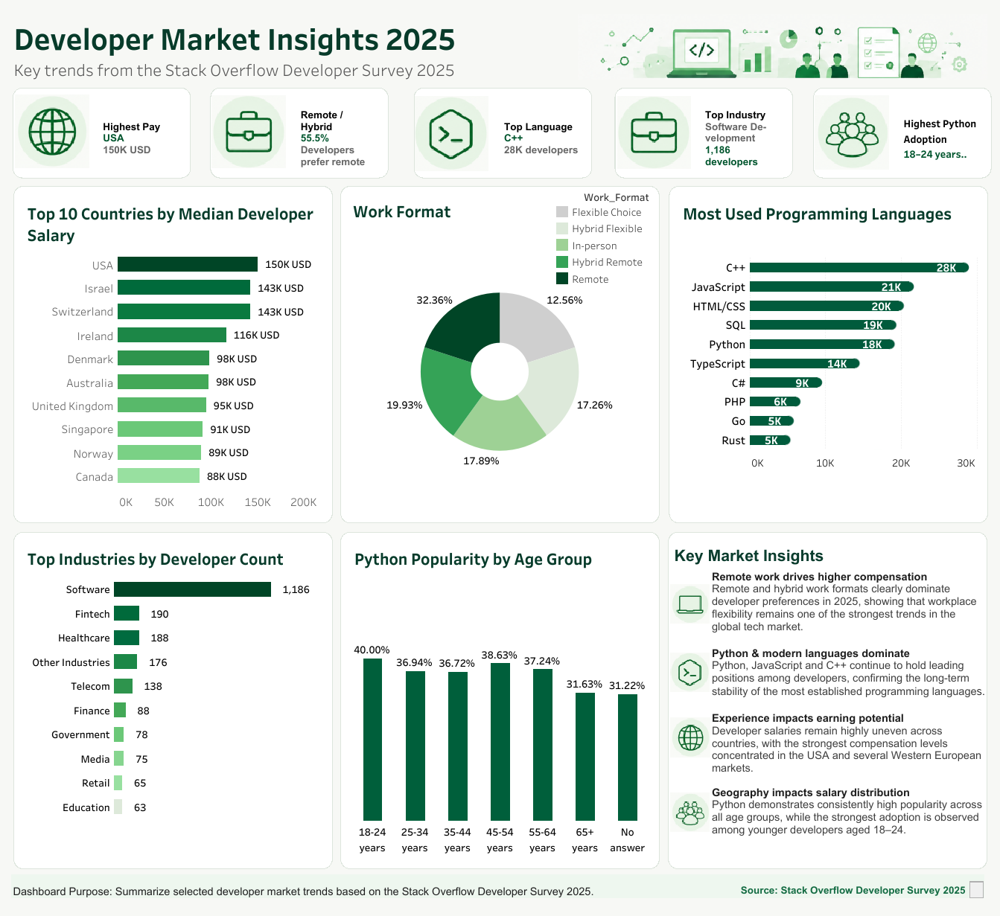

# Developer Market Insights 2025

## About the Project

This project was created as a practical exploratory data analysis project using the Stack Overflow Developer Survey 2025 dataset.

The goal was not only to build charts, but to go through a full beginner analytics workflow:
- loading and inspecting raw survey data
- checking missing values and duplicates
- cleaning incomplete records
- exploring distributions and trends
- building aggregations and metrics
- creating visual insights in Tableau Public
- presenting findings in a structured dashboard

The analysis focuses on developer salaries, work formats, programming language popularity, industry distribution, and Python usage across different age groups.

---

## Data Preparation

Before analysis, the dataset was processed and cleaned:
- checked for duplicate respondents
- reviewed missing values
- removed incomplete records in selected parts of the analysis
- prepared fields for aggregation and visualization

The project uses exploratory analysis methods and focuses on understanding patterns in survey responses.

---

## Tools & Technologies

- Python
- Pandas
- Jupyter Notebook
- Tableau Public

---

## Questions Explored

- Which countries show the highest median developer salaries?
- Which programming languages are used most frequently?
- What work formats are currently the most popular?
- Which industries employ the largest number of developers?
- Which age groups demonstrate the highest Python usage?

---

## Key Insights

- Remote and hybrid work formats remain highly popular among developers.
- Developer salaries vary significantly across countries.
- Python usage was more common among younger developer groups in the dataset.
- Software Development showed one of the strongest combinations of remote work adoption and higher salary levels.

---

## Limitations

- The analysis is based on survey responses and may not fully represent the global developer market.
- Some insights are descriptive and intended for exploratory analysis practice.
- Salary values and work preferences depend on self-reported survey data.
- The dashboard should be interpreted as exploratory analytics rather than business forecasting.

---

## Dashboard Preview

---

## Tableau Dashboard

[Open Tableau Dashboard](https://public.tableau.com/app/profile/viktoriia.serdiuk/viz/DeveloperMarketInsights2025/DeveloperMarketInsights2025)

---

## Project Structure

- `developer_market_insights_2025.ipynb` — data cleaning, analysis, and aggregations
- `Developer Market Insights 2025.png` — dashboard preview image
- `README.md` — project documentation

---

## Author

Created by Viktoriia Serdiuk as part of a learning portfolio in Data Analytics.
